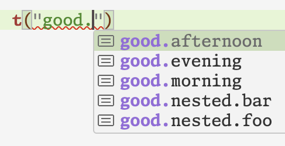
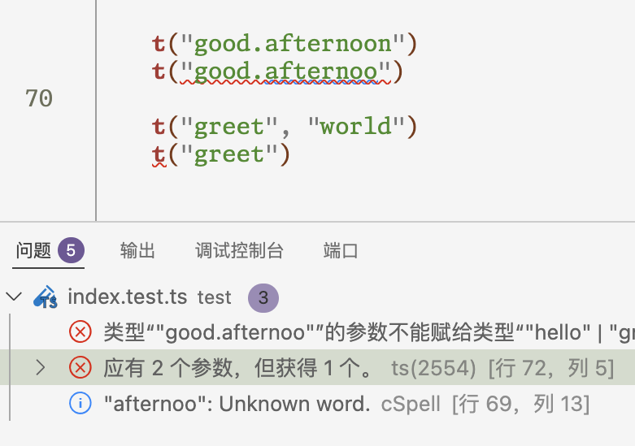

# Crazy Internationalisation

A fully-typed light-weight internationalisation solution with code completions.

## Install

```sh
npm i crazy-i18n
```

## Example

The test file is also an example, please go [there](./test/index.test.ts).

## Showcase

Assume the following template is used:

```ts
type Template = {
    hello: string
    greet: (name: string) => string
    optional?: string
    good: {
        morning: string
        afternoon: string
        evening: string
        nested: {
            foo: string
            bar?: string
        }
    }
}
```

### Key Completion

All available keys will pop up!



### Wrong Key & Wrong Arguments

Error if the key doesn't exist,
or if the translation is a function but the types of the arguments provided don't match.



## Framework Integration

To keep this library clean and tidy,
framework integration won't be implemented here.
But you do it easily by yourself!

### Next.js

> TODO

### SvelteKit

> TODO